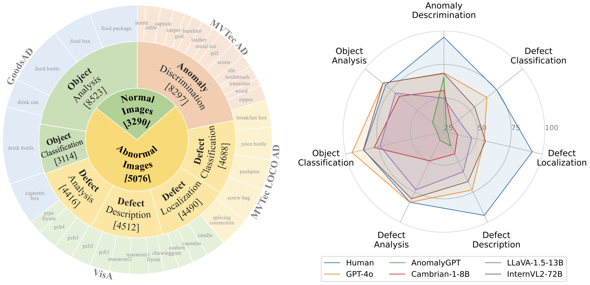

# [ICLR 2025] MMAD: The Comprehensive Benchmark for Multimodal Large Language Models in Industrial Anomaly Detection

[](https://github.com/M-3LAB/awesome-industrial-anomaly-detection)
[](https://arxiv.org/abs/2410.09453)
[](https://blog.google/technology/ai/google-gemini-next-generation-model-february-2024/#sundar-note)
[](https://openai.com/index/hello-gpt-4o/)

[](https://arxiv.org/abs/2410.09453)
[](https://huggingface.co/datasets/jiang-cc/MMAD)
[](https://zhuanlan.zhihu.com/p/23437607183)

[//]: # (## 💡 Highlights)
 Our benchmark responds to the following questions:
- How well are current MLLMs performing as industrial quality inspectors?
- Which MLLM performs the best in industrial anomaly detection? 
- What are the key challenges in industrial anomaly detection for MLLMs?

## 📜 News
- **[2025-07-08]** We've added support for the Qwen2.5-VL series, which has raised the bar for open-source general-purpose models. 
- **[2025-05-26]** Main experiment results are in ./all_results for detailed research.
- **[2025-01-28]** MMAD paper is accepted by [ICLR 2025](https://openreview.net/forum?id=JDiER86r8v).
- **[2025-01-08]** We released a human baseline for MMAD along with some further analysis. For more details, please refer to the latest [paper](https://arxiv.org/abs/2410.09453).
- **[2024-12-16]** We have released textual domain knowledge for anomaly detection, which can be used for image-text research in MMAD dataset. 
- **[2024-10-30]** The full dataset is released at [Hugging Face](https://huggingface.co/datasets/jiang-cc/MMAD), including images and captions. You can download the whole dataset easier now!
- **[2024-10-16]** MMAD paper is released at [arXiv](https://arxiv.org/abs/2410.09453).
- **[2024-10-08]** MMAD dataset and evaluation code are released. 


## 👀 Overview
In the field of industrial inspection, Multimodal Large Language Models (MLLMs) have a high potential to renew the paradigms in practical applications due to their robust language capabilities and generalization abilities. However, despite their impressive problem-solving skills in many domains, MLLMs' ability in industrial anomaly detection has not been systematically studied. To bridge this gap, we present MMAD, the first-ever full-spectrum MLLMs benchmark in industrial Anomaly Detection. We defined seven key subtasks of MLLMs in industrial inspection and designed a novel pipeline to generate the MMAD dataset with 39,672 questions for 8,366 industrial images. With MMAD, we have conducted a comprehensive, quantitative evaluation of various state-of-the-art MLLMs.




## 📐 Dataset Examples
We collected 8,366 samples from 38 classes of industrial products across 4 public datasets, generating a total of 39,672 multiple-choice questions in 7 key subtasks.


[//]: # (## 📊 Results)


## 🔮 Evaluation Pipeline

### 1. Data Preparation

Prepare the evaluation dataset by following the instructions provided in the [README.md](dataset/README.md) file located in the dataset folder. 

Or you can directly download the dataset from [Hugging Face](https://huggingface.co/datasets/jiang-cc/MMAD). 
```bash
cd dataset
# Make sure you have git-lfs installed (https://git-lfs.com)
git lfs install
git clone https://huggingface.co/datasets/jiang-cc/MMAD
```
Or download the ZIP file:
```bash
cd dataset/MMAD
wget -O ALL_DATA.zip https://huggingface.co/datasets/jiang-cc/MMAD/resolve/refs%2Fpr%2F1/ALL_DATA.zip?download=true
unzip ALL_DATA.zip
```

### 2. Model Configuration

Due to different MLLMs' input and output handling methods, we have created separate example files for each MLLM being tested, which can be found in the evaluation folder.

For Gemini and GPT4, an API KEY is required and should be provided in the respective file.

For Cambrain, LLaVA, and SPHINX, the environment must be set up as per the original repository. (Here are the addresses to refer to: [Cambrain](https://github.com/cambrian-mllm/cambrian), [LLaVA-NeXT](https://github.com/LLaVA-VL/LLaVA-NeXT/), [SPHINX](https://github.com/Alpha-VLLM/LLaMA2-Accessory))

For Qwen, MiniCPM, InternVL, and similar models, simply install the transformers library (`pip install transformers`).

### 3. Run Evaluation

Each test file uses the `--model-path` argument to specify the model, and `--few_shot_model` to indicate the number of normal samples in the prompt.

Examples:
```
cd ./evaluation/examples/Transformers
python internvl_query.py --model-path ../../InternVL/pretrained/InternVL2-1B

cd ./evaluation/examples/LLaVA_Query
python llava_query.py --model-path ../../LLaVA/llava-v1.6-34b/ --dtype 4bit
```

## Domain Knowledge

Our experts, with the assistance of large language models, have summarized the detection content for each category in MMAD, including descriptions of normal features, anomaly classifications, and detailed descriptions for each category. The data can be found in [dataset/MMAD/domain_knowledge.json](https://github.com/jam-cc/MMAD/blob/main/dataset/MMAD/domain_knowledge.json). 

## 👨‍💻 Todo

- [x] Release the dataset (manual version)
- [x] Release the evaluation code
- [x] Release the paper
- [x] Release full version with images included on Hugging Face
- [x] Release domain knowledge
- [x] Release human baseline
- [ ] Maintain a leaderboard for MMAD

## BibTex Citation

If you find this paper and repository useful, please cite our paper☺️.
```bibtex
@inproceedings{Jiang2024MMAD,
title={MMAD: The Comprehensive Benchmark for Multimodal Large Language Models in Industrial Anomaly Detection},
author={Xi Jiang and Jian Li and Hanqiu Deng and Yong Liu and Bin-Bin Gao and Yifeng Zhou and Jialin Li and Chengjie Wang and Feng Zheng},
booktitle={The Thirteenth International Conference on Learning Representations},
year={2025},
url={https://openreview.net/forum?id=JDiER86r8v}
}
```
